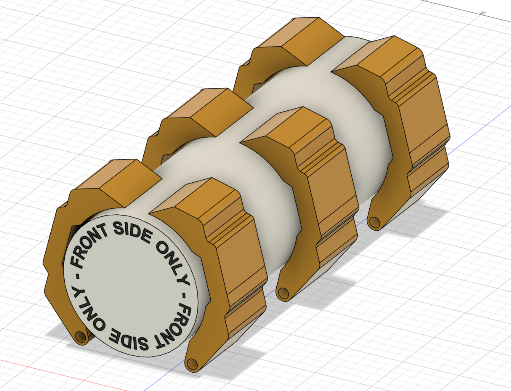

# Rapid Remote Response Vehicle (RRRV)
This Markdown document details the design process used and the troubleshooting that was involved in creating my RRRV.  
This work was completed as part of VCE Systems engineering Units 3 and 4.  
I wrote this all in markdown for the simplicity and accessablility, as well as generally being more pleasant than using word or powerpoint
There are most likely spelling mistakes and gramatical errors in this document as VScode doesnt come with a spellchecker and I am yet to find an extension that will allow me to spellcheck nicely....not that spelling is a priority at the moment 

# Overview
## What am I building?
I will be building a remote playload delivery vehicle with a first person view camera. the idea of this vehicle is similar to a bomb disposal robot. Its strength is that it can be used to access areas that are not safe for humans. It will be capable of delivering a payload and navigating complex terrain.  
In more detail, I am going to be equipping my own existing remote control car (Traxxas Slash 4x4) with the equipment needed to drive into an area unsafe for humans so that it can deliver a payload. The car will be run using [Ardupilot Rover](https://ardupilot.org/rover/), and will be able to deposit its payload remotely.  
The payload in question will not be a bomb, I promise. Rather it will be medical supplies or food.  
Even if 
## Why not a plane?
I'm not designing this for war, but in the event of one, drones and planes can be shot down out of the sky after being picked up on radar. The last thing we want is a urgent and valuble supply drone to fail to complete an urgent mission. A ground vehicle is slower, but could drive along the desert for days on end undetected (and with solar panels too!).  
# Initial Planning and design 
## The Car 
The car is a Traxxas Slash 4x4 VXL
I will be using it as a base, as it has all the features I need and will allow me to focus on the autonomy + Payload. The last thing I need is to be trying to build and diagnose two systems at the same time. The Slash is very robust and reliable, and stands up to large amounts of abuse with ease (trust me, I've tested it). Its also something I am fairly confident with, as I understand it and how it works. Mine has an upgraded steering servo as a bonus as well. 

See [ROVER.md](/journal/ROVER.md) for more information

<i>Picture of the car pre-systems</i>  

## The Autopilot 
I will be using [Ardupilot Rover](https://ardupilot.org/rover/) to automatically drive the car and complete GPS waypoint based missions.  
According to their website:   

<i>Rover is an advanced open source autopilot for guiding ground vehicles and boats. It can run fully autonomous missions that are defined using mission planning software or pre-recorded by the driver during a manual run.</i>

This is perfect for me as I will be able to set up missions around the school to demonstrate the capabilities of my project. 

Documentation for the autopilot side of things will be documented in [ROVER.md](/journal/ROVER.md), as it is all part of designing the rover.

### Background
Ardupilot itself was originally designed as low cost autopilot for remote control aeroplanes and boats, but has also been adapted to run "rovers" as well. Think Mars Rovers. 

It works by acting as a remote control for the vehicle its being used on. It essentially replaces the preinstalled reciever on the "rover". It knows its own position using a GPS module, and connects to a Ground control station for mission instructions and waypoints. 

Overall its a very well sorted system and will make the Autonomous driving part pretty easy (touch wood), allowing me to focus more on the Payload system.

### Hardware
Ardupilot doesn't need much hardware, meaning it will be relatively cheap to install on my car. Below is a brief list of the Hardware I will need:  

- Ardupilot control module
- GPS module
- Telemetry/control TX/RX system
- Sonar/IR for obstical avoidance (maybe)

See [This Section](/journal/ROVER.md#navigation-computers) for which exact bits I used and why.

### Software
I will be using [Mission Planner](https://ardupilot.org/planner/index.html#home) for my Ground Control Software (GCS) as it is the most supported and popular GCS for Windows. 

As you can see in the screenshot above, Mission planner will allow me to create a set of waypoints which my rover will use GPS to navigate to. Mission planner will also be able to show my FPV camera footage in its HUD if needed, but I could also do a VLC stream if I needed.

## The Payload

See also [Payload System](/journal/PAYLOAD.md)

My initial ideas for the payload so far have been to deliver a cylinder about the size of a 600ml water bottle or maybe a pringles can. The payload will be secured to the vehicle via a custom designed clamping system. I am considering using a seatbelt style strap + tensioner as well, which would allow me to secure multiple types of package. 

### A Cylinder? Why not a box
I am choosing to use a cylinder for a couple of reasons, primarily because they are very easy for a human to hold due to the shape. It also gives me a fun engineering challenge in terms of securing it as it is more complex and less conventional compared to a box. A cylindrical payload could also be transported via other methods, and would be far better for transporting liquids for human consumption (who knows, someone could really really need a bottle of mount franklin!). 
### Securing the Payload

I am going to use a clamping system to secure the payload to the vehicle. I want this system to be adaptive to the size/shape of the payload, allowing shapes like water bottles to be held firmly in place. I will have 6 clamping arms along the long side, with another thing at the end to prevent sliding forwards and backwards. The front side will be pressed up against part of the vehicle.

  

<i>Demonstration of initial clamp design and its pivot point</i>

Ideally the clamps can move independently of each other, allowing the greatest flexibility. This does present a problem however: how do I move all 6 (or 3 pairs of 2) at the same time, without needing 
6 individual motors?

I continue the design process for this part in the [PAYLOAD.md](/journal/PAYLOAD.md) document.