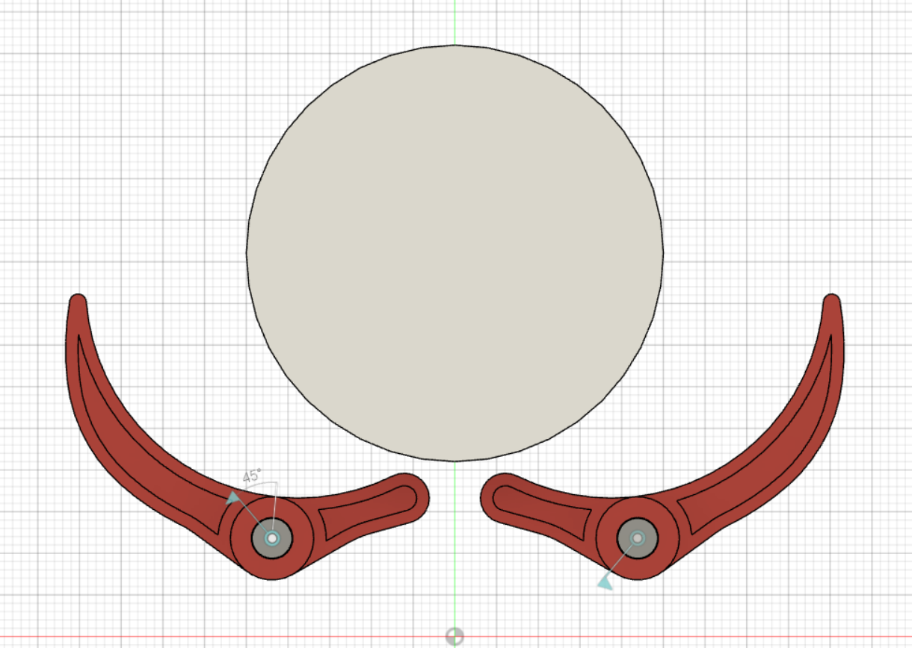

#### [< Back to README.md](/README.md)

# Payload Grabby Thing
This document details the design process I used to create the Clamps system that will secure my payload. 

## Initial Designs 

I designed the inital clamps whilst on a plane to western australia, and all they really do is grab the payload and pull it down. They were very simple clamps but they worked, somewhat. I was sitting next to my dad on the plane, so him and I discussed the clamps and their shape quite a bit, and we started focusing on shape optimisation.

With my dads reccomendation I removed as much excess material as possible to create the most barebones clamp possible, then I can make it look pretty once I know all the design constraints. 
Using a stress test we can see that there is not much, if not very little wasted material.

You can also see in this image that just around the pivot point there is significant stress. Ideally when I complete the design it will have two points, allowing for better load distribution. I will also add some extra material if required... we will see...

The other issue is failure modes. Ideally, the clamps fail shut so that the cargo is locked in place until it reaches its destination, where, upon arrival, it can be removed via a manual override. If the clamps were to fail open whilst the car was driving then the payload could be lost, which would mean mission failure

Steering servos use gears and can be moved pretty well by hand, but ideally I dont need 6 of them, and If I did have 6 they would have to be relatively powerful to keep the payload sercured. I could also use a set of very small linear actuators, however that would be incredibly complex and silly, as well as very hard to override manually As an engineer, I am required to find an incredibly simple, "why didn't I think of that before" type solution. I think said solution will most likely involve springs in some way.

# Design Process 

I started by thinking about the motion I want the payload to follow when it is loaded and unloaded, and realised that I could get the clamps to follow the payloads motion via pressure, The idea being that the payload pushes the clamps themselves as it goes down, and then the payload can be further locked in place, whether thats via a manual switch or an electronic one, I dont know yet, but it will be whatever suits. I probably don't need to have remote control over this, but that depends on how well people react. Some collaboration with the psychology students may be an order.

## Automatic Mechanical Clamping 

Hopefully the following screenshots help with understanding the motion I intend for the clamps to follow.

To test this idea, I will need to construct a prototype and see how it performs.

To start with, I will be using a half length pringles can as my payload, as it is pretty close in size to what I envision my payload to be, and its something I have access to right now and can easily get more of. I can also use the contents of said pringles can to keep myself motivated and continue to work on this project.

To begin with, I modelled the can in Fusion360, my weapon of choice for designing this project. I get a free license through the education department, so I may as well. 

Designing the pringles can was pretty easy, it's just a cylinder after all

I then scaled up the clamp I designed previously to match the new size of the pringles can, as well as further refining it to secure the payload better. 

I initally wanted to make 6 clamps but I deemed that would be too much for just the prototype, So I ended up just making 4 instead. I probably only needed to make one pair of 2, but I want to make something a little bigger. 

I also added some 3mm thick plates for the whole thing to sit on, that way I can sit the prototype on my bench and test it, rather than trying to somehow hold it in place and manuveur things around. It was also around this point I realised Fusion360 had a high DPI mode, which is very nice and will mean my screenshots from this point onwards will look alot nicer!

