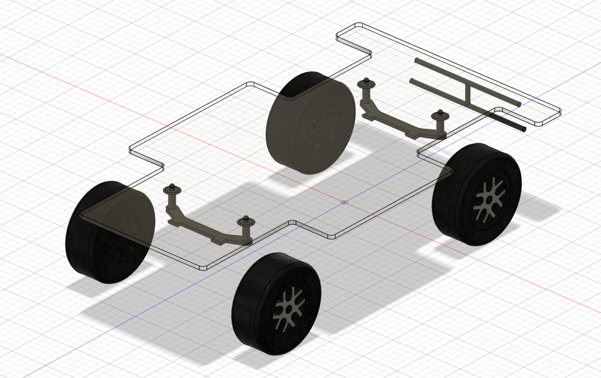

#### [< Back to README.md](/README.md)

# Systems Weekly Journal 2023

## 23rd February  
I managed to find some spare time during the class to laser cut a prototyping plate for my project, however it was a little too thick. however I am not sure if I will be able to make them any thinner due to flex. Next period, I will test how much the plate (made of acrylic) will affect the center of gravity of the vehicle

## 24th February
I tested the the acrylic plate on my remote control car, and once I made it fit (Kind of) It stayed on the car through some low speed testing maneuvers without much increase in body roll. When a weight was placed on the car, the body roll was amplified substantially, but the car remained planed -the suspension did its job.

#### Between here and my next entries not alot of work was completed due to us learning about other concepts including AC power and transistors
#### On the 26th of March I started writing my folio in this repository instead of Simplenote as it turned out not to be well suited formatting wise

## 1st of April through till 16th April
Whilst I have been on holiday in WA I have been doing bits of work here and there to catch up and hopefully get ahead a bit.

Whilst on the plane, I prototyped my initial clamping system design in more of a prototyping sort of way, allowing me to sleep on my idea for a couple of nights and then come up with my current design a little while later.

I also went through and researched solutions for my navigation systems and eventually figured out which one I wanted. 
