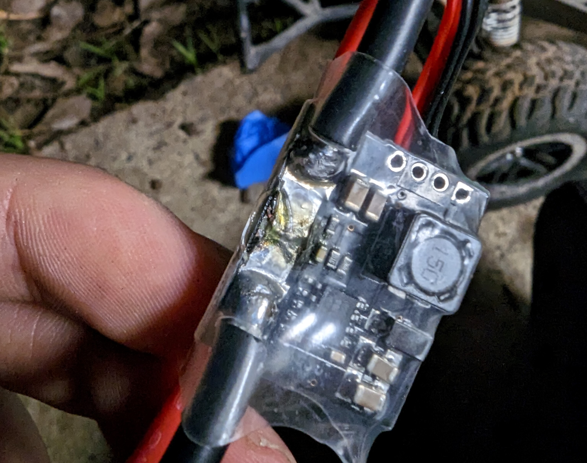
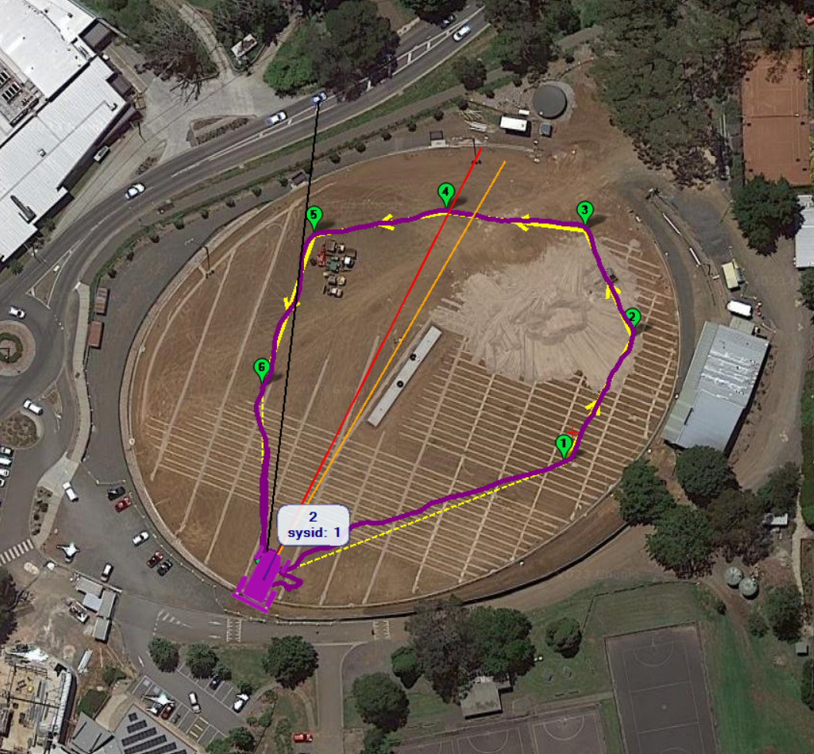
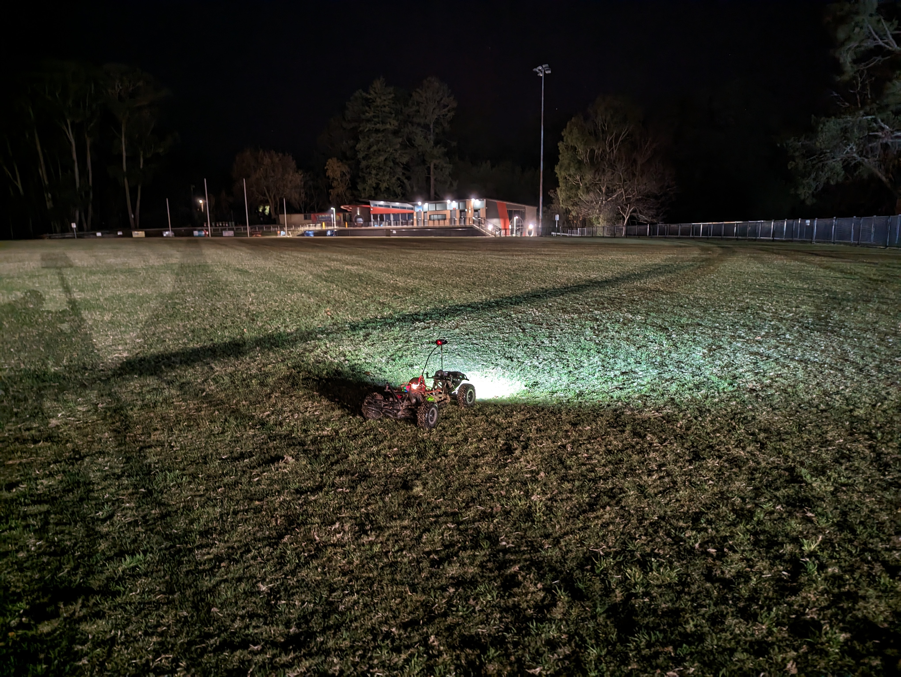
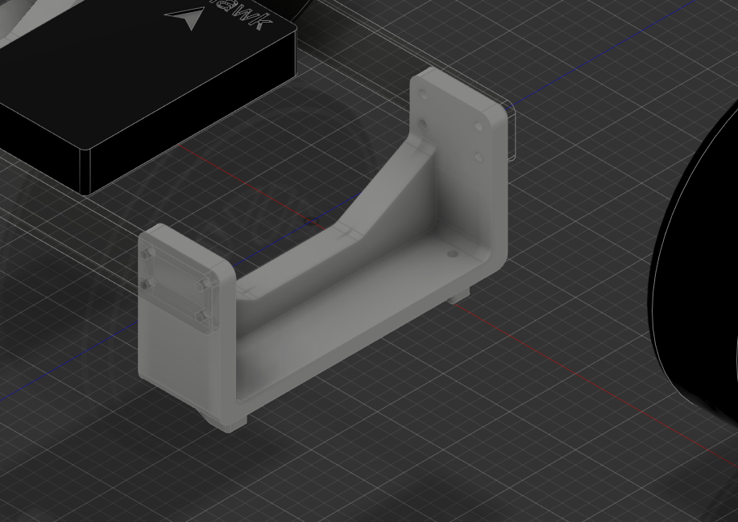
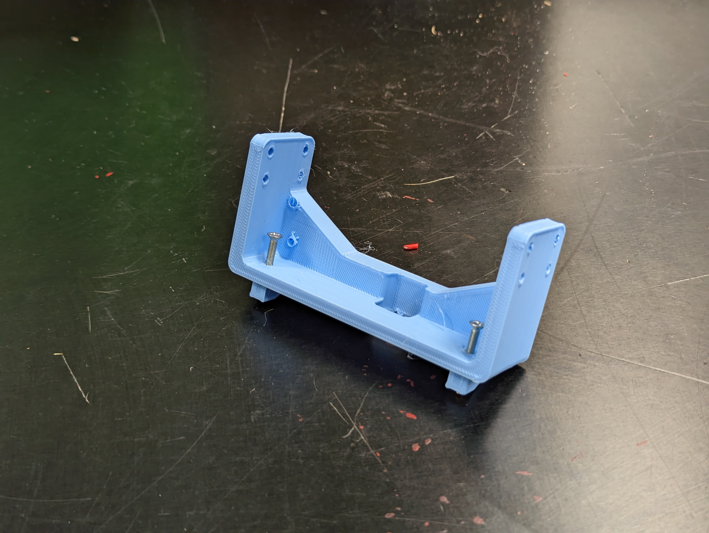

#### [< Back to README.md](/README.md)

# Systems Weekly Journal 2023

## 23rd February  
I managed to find some spare time during the class to laser cut a prototyping plate for my project, however it was a little too thick. however I am not sure if I will be able to make them any thinner due to flex. Next period, I will test how much the plate (made of acrylic) will affect the center of gravity of the vehicle

## 24th February
I tested the the acrylic plate on my remote control car, and once I made it fit (Kind of) It stayed on the car through some low speed testing maneuvers without much increase in body roll. When a weight was placed on the car, the body roll was amplified substantially, but the car remained planed -the suspension did its job.

#### Between here and my next entries not alot of work was completed due to us learning about other concepts including AC power and transistors
#### On the 26th of March I started writing my folio in this repository instead of Simplenote as it turned out not to be well suited formatting wise

## 1st of April through till 17th April
Whilst I have been on holiday in WA I have been doing bits of work here and there to catch up and hopefully get ahead a bit.

Whilst on the plane, I prototyped my initial clamping system design in more of a prototyping sort of way, allowing me to sleep on my idea for a couple of nights and then come up with my current design a little while later. I then started working on figuring out which navigation computer I was going to use, and eventually found a kit that will talk to my systems teacher about purchasing (not with my systems budget however...). After this, I began designing a rough drawing of the baseplate, which I will improve upon once I get home. I will also plot out where the standoffs will screw in and stress test the whole thing so that it can withstand rough driving.
co
## 3rd of May 
At the start of this week I ordered the navigation computers. They will arrive by the 22nd of May, apparently.

I started prototyping the navigation platform, via means of cardboard cutouts, allowing me to get the dimensions perfect and deal with any obstructions that I would have run into without, like the 2.4ghz antenna and the rear shocks. 

I also 3d printed my clamping arms meaning I can construct my clamp prototype after I finish building the navigation platform. I am prioritising the navigation platform so that I when the computer arrives I am ready to install it, And I'll use the time inbetween to work on the clamping system. I also need to finish the navigation system first so that I can decide where and how the payload system will be mounted. 

## 10th of May
In this session I started redesigning my body mounts to account for the fact that I did not have long enough standoffs. This is not an ideal solution, but it will have to make do. I does have the side effect of allowing me to mount ports underneath the navigation platform, which is helpful.

I laser cut two of these mounts without checking if the other side would fit, and suprise! it did not. I did not have enough time to finish these clips, so they would have to wait until next session.

## 17th of May

I finished prototyping and building the navigation platform mounts, which is great because I was able to finally put the mounting holes in the navigation platform. I will be able to laser cut the navigation platform next week (or later this week if I'm lucky...) and I will be ready for the computers to arrive, which is very exciting! According to AusPost, they should arrive tomorrrow or the day after, which will mean that if I have the time I could probably get them fully operational by next week. 

## 18th May through till 22nd

The parts arrived, and were packed relatively well. Everything I ordered was there and on the 18th, I began setting up the autopilot system. The first issue I had was "NO GPS", which was caused by the fact that the GPS module that came with my kit was fitted with a diffrent connector than the one required. The pixhawk wanted a 6 pin connector, but my GPS was equipped with a 5 pin. This is actually normal for this particular GPS, and it comes with a 6 pin connector, so I followed [This tutorial](https://www.youtube.com/watch?v=6nLe9_2Fyok) and repinned it, which worked perfectly. 

The next day, I added all the parts to my rover and took it outside, where I let it gather GPS data for a bit. I wasn't really looking for anything in particular, it was more just proof of concept 

### GPS accurracy 

I managed to get GPS accuracy down to about 4m, which isnt too bad, but ideally I would manage to get it down further. on a large scale mission, it doesnt matter too much, but it would be nice to have more precision, which I might be able to achieve via differential GPS, which is what is used on farms to get accuracy down to the centermeter. Using a usb GPS plugged into my laptop, with my laptop in a known location, then I could use [This Ardupilot Module](https://ardupilot.org/mavproxy/docs/modules/DGPS.html) to achieve much greater accuracy. I would like to get down to 1 meter if possible , which would mean I could do laps of the school oval, or even navigate around the school. It would mean I could also drive the rover on single laned road sized paths and stay on the road at all times, which would be great. I am unsure how good the native DGPS would be, and I have looked into finding a free DGPS subscription, but with no luck. I have enabled [SBAS](https://www.amsa.gov.au/safety-navigation/navigation-systems/satellite-based-augmentation-system-sbas) which has given me much more consistent GPS data as seen below

  

<i>no SBAS</i>

  

<i>SBAS (media coming soon, when I was testing SBAS it started raining and I had to recover the rover)</i> 

As you can see, the addition of SBAS has improved the amount of drift significantly.

### Return to Scheduled Programming - Trying to build a rover

Later that night, I started trying to get the rover into a state where it would be able to drive itself. The pixhawk itself does not support [PWM](https://en.wikipedia.org/wiki/Pulse-width_modulation) inputs, but thats what my remote puts out, so I had to use a PPM encoder, which came in the kit that I bought. The encoder actually runs on an AT mega 328P (?), so you technically make one out of an arduino nano.... not that you'd want another thing to diagnose. With everything setup, I was having issues getting my GPS to connect to satellites, switching the parameter from auto to ublox (the brand of my gps) solved this.

I wanted to test my rover in manual mode first, before letting it drive itself around, and when doing this I encountered some very unusual behaviour. The rover would steer to the left when I increased the throttle, and steering would occasionally cause the throttle to go full backwards or fowards. I tried everything, including purchasing a new transmitter... and ended up just doing a full parameter reset, which fixed things. After this, I got super excited and decided to take the rover for its first auto drive, which didnt go very well. Before I sent it a new mission, The rover started freaking out, before trying to take off whilst setting the power supply on fire at the same time. This was not ideal, but I disarmed the rover and unplugged the dodgey cable as fast as I could. After this, the rover was acting fine, with the Pixhawk running off the ESC's power supply via the PWM output rail. This is not the reccomeneded way to power it, and I will purchase another power supply cable if need be. 

<i>The failed power supply cable</i>

After my little scare, I tried to get the auto mode working again, but just sitting in hold mode, the rover tried to reverse intermittently, which was not ideal. since with my current remote I don't have reverse anyway, I put the ESC in race mode, which disables reverse. This solved the problem. I was able to get the rover to drive up and down my driveway without issue, with relatively inaccurate gps signal it wasn't the most precise, but it works well enough for now,

I got the rover to drive up and down on our driveway in guided mode, which worked! I took this oppturnity to tune the rover a bit, and give it access to enough power to get up the hill.

## 23rd May

I decided to take the rover for a proper test run. There's a big oval not far from where I work, so Dad and I headed there after work to see how well things would work. I kinda expected something to fail but no, everything worked perfectly the first time, which never happens! I did a couple of guided, "fly to here commands to get an idea of how the rover would drive. I decided to up the throttle amount it could use from 30% to 50%, and this seemed to smooth things out. The turning radius is huge, so I want to spend some time tuning it. I gave the rover a set of waypoints to follow, and it did so with ease, all whilst keeping a pretty good gps track

<i>Don't worry, the satellite images are out of date. I did not trespass onto a construction site to test my rover</i>

In this image you can see the rover kinda swerves around on its way to the waypoint. This is due to the fact that I did absolutely zero compass calibration before the run, and the gps isn't quite mounted facing the right way. I think the rover actually did a very good job correcting for this. As we were doing our test runs towards the later end of the day (I got off work at 10pm) we resolved to attach a headtorch to the rover to act as "headlights". And maybe some tailights. and maybe some port/starboard lights.

<i>I should have taken a video...this will do for now</i>

There are two things I want to change

1. Obstacle avoidance. The rover was getting really close to crashing into me and my "base station". current ideas include ultrasonic (arduino sensor) or using my old Xbox kinect.
2. Isolating the environment from the guts of the rover. I managed to pick up every single grass clipping ever with my rover. This is not good.

## 31st May 

Between now and my last entry, I had to deal with a bunch of electrical gremlins. I wont go into detail, but basically, my Traxxas VXL-3S ESC did not want to play ball with my autopilot computer. Luckily for me, I had a spare, amazon special esc which worked fine. 

The next thing I wanted to do was to improve the mounting system. I made up some parts in fusion360. The idea with these was to make my mount alot stronger and less wobbly, reducing stress and enabling me to mount things better. 

I then 3d printed these pieces, one at a time due to the dubious reliablility of the 3d printers. I only got the first one done today, and the second one was completed about an hour after school finished, so I'll get another photo once both are finished.

  
  

Notice that the reciever and ESC just floating around in the car. My next plan is to make up a plate for them to mount to with doublesided tape. This will make things alot nicer.

I still havent gotten around to sorting out obstacle avoidance. That will come as soon as I can sort out all the other electronics first.

## 7th June 

This week, I finished printing the other mount and laser cut some cross braces. I built holes into the cross braces, that way I could mount the pixhawk and I also lowered the GPS. I was initially concerned about the GPS getting less reception due to being down lower, but in practice, this was not the case. I did have a display on the rover, but that has inexplicably ceased to work, so I don't know how many satellites... I think I can use ardupilot to give me a readout. 

I also mounted the speed controller and reciever much lower and properly wwith 3M DualLock velcro tape, which works really well.

After some brief testing, I found that I needed to make some mudguards to stop grass and mud entering the rover. I prototyped some parts out of cardboard, which worked pretty well and got rid of 99% of the debris, but the cardboard was not going to last very long, see below:

To fix this, I made some new parts out of coreflute.